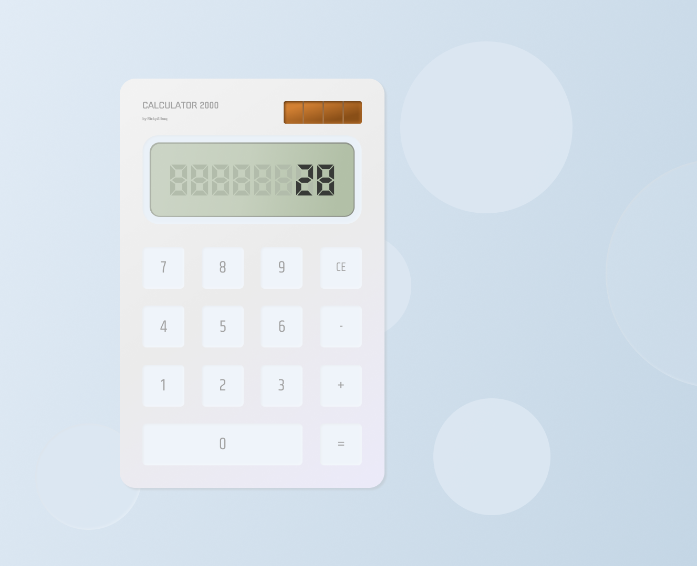

<h1 align="center">Calculator 2000</h1>

Calculadora básica feita utilizando apenas HTML, CSS e um pouco de JavaScript com JQuery.

 <a href="#ideia">Ideia</a> •
 <a href="#tecnologias">Tecnologias</a> •
 <a href="#autor">Autor</a>

### Ideia

  

Projeto pessoal desenvolvido por mim com base no trabalho do [GanKin](https://dribbble.com/shots/9620541-Smarthome-App-Concept), me inspirei no uso do painel de segmentos para desenvolver uma calculadora virtual. 

### Tecnologias

As seguintes ferramentas foram usadas na construção do projeto:

- HTML 5
- CSS 3
- JavaScript ES6+
- [JQuery](https://jquery.com/)

---

### Autor

Made with 💜 by RickyAlbuq 👋

